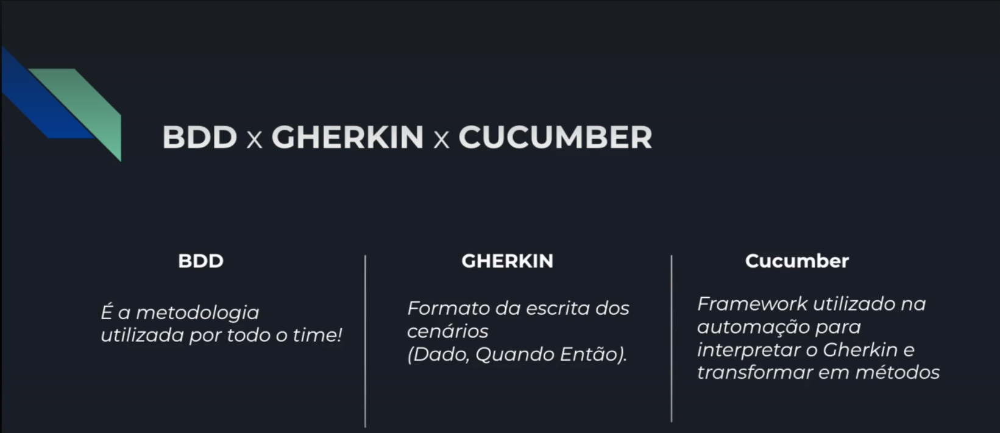

##PROJETO AVANÇADO DE SELENIUM COM JAVA

Executando testes via cmd

ex passando uma variavel 
mvn test -Dtest=RunCucumber -Dbrowser=chrome cluecumber-report:reporting

git push -u origin main

echo "# selenium-java-avancado" >> README.md
git init
git add README.md
git commit -m "first commit"
git branch -M main
git remote add origin https://github.com/kelvinsilva1995/selenium-java-avancado.git
git push -u origin main

Execução dos Testes

mvn test -Dtest=RunCucumber -Dbrowser=chrome

Gerar relatorio apos execução

mvn cluecumber-report:reporting

Rodar no CI

mvn test -Dtest=RunCucumber -Dbrowser=chrome-ci cluecumber-report:reporting

Criar nova branch

git checkout -b feature/nome-branch~~